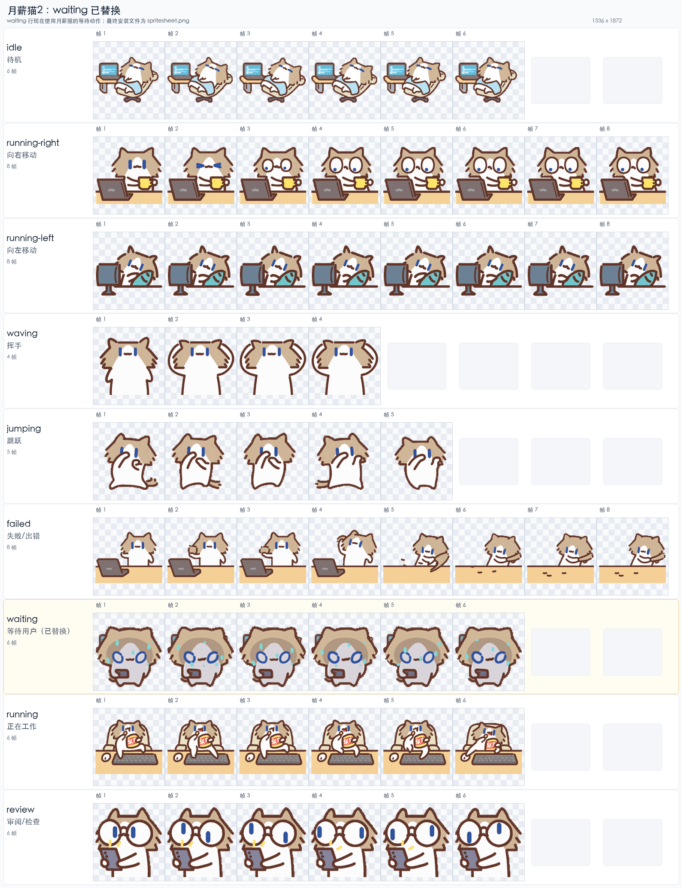

# 月薪猫2 Codex 桌宠

[中文 README](README.md) | [English README](README_EN.md)

这是一个可以安装到 Codex 桌面端的本地宠物包。宠物名称是 **月薪猫2**，图集已经整理成 Codex 可读取的 9 个标准动作版本。



## 文件内容

| 文件 | 说明 |
| --- | --- |
| `pet.json` | Codex 宠物配置文件，定义宠物名称、描述和图集路径。 |
| `spritesheet.png` | 宠物动画图集，尺寸为 `1536 x 1872`。 |
| `assets/preview-standard-actions.png` | 9 个标准动作的逐帧预览图。 |
| `NOTICE.md` | 素材来源和署名说明。 |
| `LICENSE-NOTE.md` | 授权提醒。 |

## 动作列表

这个版本包含 9 个标准动作：

| 行号 | 动作 | 中文说明 | 帧数 |
| --- | --- | --- | ---: |
| 0 | `idle` | 待机 | 6 |
| 1 | `running-right` | 向右移动 | 8 |
| 2 | `running-left` | 向左移动 | 8 |
| 3 | `waving` | 挥手 | 4 |
| 4 | `jumping` | 跳跃 | 5 |
| 5 | `failed` | 失败/出错 | 8 |
| 6 | `waiting` | 等待用户 | 6 |
| 7 | `running` | 正在工作 | 6 |
| 8 | `review` | 审阅/检查 | 6 |

## 这版做了什么改动

- 保留了 `Tinsiag/YueXinMiaoPet` 版本的的大部分动作。
- 将 `waiting` 等待动作替换成了 `LLMPET assets/cat` 的 `waiting` 动作。
- 使用 PNG 作为最终图集格式，避免透明区域在 WebP 保存后出现隐藏颜色残留。
- 已通过本地校验：`1536 x 1872`、8 列、9 行、透明区域干净。

## 安装方法

### 方法一：直接复制文件夹

1. 下载这个仓库。
2. 将整个文件夹放到本机的 Codex 宠物目录：

```bash
~/.codex/pets/yuexinmiao-2
```

3. 确认目录结构如下：

```text
~/.codex/pets/yuexinmiao-2/
├── pet.json
└── spritesheet.png
```

4. 重启 Codex，或者在 Codex 里重新切换一次宠物。

### 方法二：命令行安装

在仓库目录下运行：

```bash
mkdir -p ~/.codex/pets/yuexinmiao-2
cp pet.json spritesheet.png ~/.codex/pets/yuexinmiao-2/
```

然后重启 Codex 或重新切换宠物。

## 排查方法

如果 Codex 里没有看到新宠物，可以检查：

1. `pet.json` 和 `spritesheet.png` 是否都在 `~/.codex/pets/yuexinmiao-2/` 目录下。
2. `pet.json` 里的 `spritesheetPath` 是否是 `spritesheet.png`。
3. 是否已经重启 Codex 或重新切换宠物。
4. 图集尺寸是否为 `1536 x 1872`。

## 适用范围

这个包适合用来分享给已经在使用 Codex 桌面端、并且知道如何添加本地宠物的朋友。

## 素材与授权提醒

这个仓库只是整理和打包本地宠物文件。素材来源与署名请查看 `NOTICE.md`。在公开传播或二次创作前，请自行确认原始素材的授权和分享范围。
